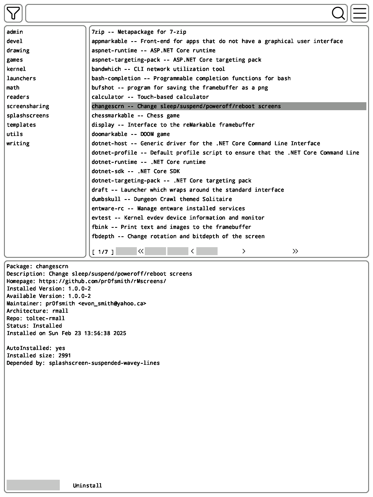
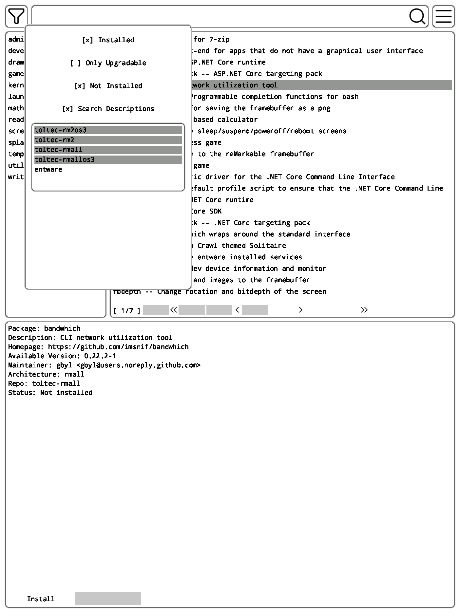
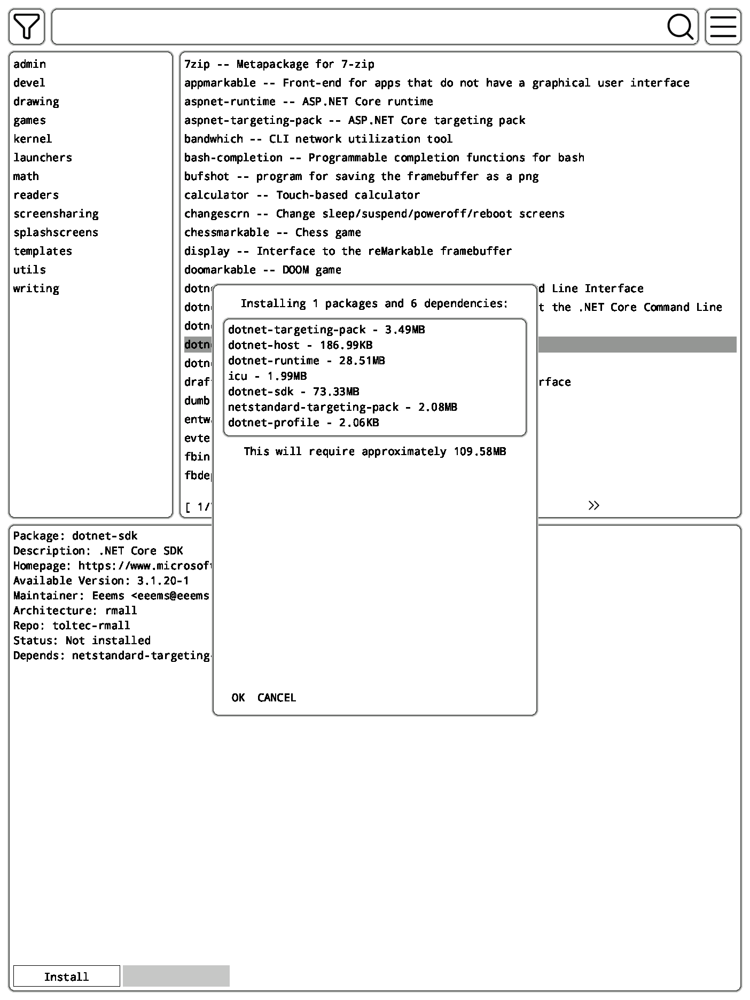

# rempack

RemPack is a friendly package manager for the ReMarkable 2 tablet.

This is targeted specifically at the ReMarkable 2, but it will likely compile fine for RM1 and other tablets targeted by rmkit. If you run this on another device, I'd love to hear about it!

</img>

### What is this?

This is a package manager heavily inspired by [Octopi](https://github.com/aarnt/octopi), the inarguable and undisputed best package manager available for Arch linux. It allows you to search, browse, and install packages from the [Toltec]() and [Entware]() repositories, which is the standard for ReMarkable tablets as well as similar devices.

Under the hood, the hard work is done by opkg, which is the native command-line package manager for these devices. This application mainly consists of a pleasant UI which invokes opkg commands behind the scenes. All of the advanced features rely on a custom parser that reads the opkg repo cache from disk and constructs an in-memory structure that can be searched and traversed rapidly. This is what enables searching and filtering with minimal delay.

# WARNING

Rempack is still *very* early in development and not yet feature-complete, or even thoroughly tested. While I feel that the risk of irreparable damage to your operating system is low, it is *not* zero. Rempack does not (yet) have any kind of guardrails or protections beyond what opkg itself provides. You *can* wreck your system with this tool!

Please consider this unstable software. If you aren't comfortable with fixing opkg errors yourself, you shouldn't use this just yet. Please check back later once development has progressed!

Standard no-warranty disclaimer applies. I can't take responsibility for your tablet turning into a grue.

### What can it do?

Right now, rempack can filter by categories (sections), full text search of package names and descriptions, and filter by repository. It can also filter installed/not-installed and upgradable packages. 

</img>
</img>

Do note that by default, the `entware` repo is hidden. This is a more general repository intended for openwrt devices, among other things. It's hidden because it drowns out the remarkable-focused toltec repositories.

Hidden repos **do not** currently show up in search results, but it is planned.

### Why is this?

I want a package manager that makes discovering new applications pleasant and easy.

Due to the way opkg works, and the hardware limitations of the tablet, using opkg directly is *extremely* slow. This project aims to alleviate that as much as is possible.

The goal is to make the opkg repositories browsable, sortable, and searchable by anyone. If you like using the package manager, you'll probably install more programs, which makes package developers (me) happy.

### Installation

Once this package is added to the toltec repository, you can install it with `opkg install rempack`, or another package manager.

Pre-release builds are hosted [on my GitLab server](https://gitlab.onionstorm.net/rolenthedeep/rempack/-/releases)

You can run the binary directly or install the `.ipk` with opkg.

### Bugs

Best place is the issue tracker on [GitHub](https://github.com/rexxar-tc/rempack/issues)

### Goals

- [x] Aggregate repo browsing
- [x] Search engine
- [x] Filters
- [ ] What's new
- [ ] Repo manager
- [x] Seamless opkg repo update
- [ ] Update notifications
- [ ] Popularity contest
